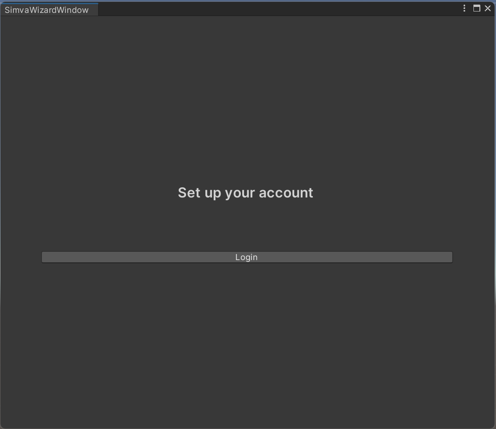
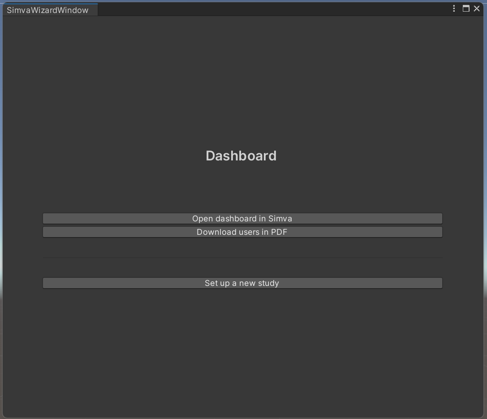
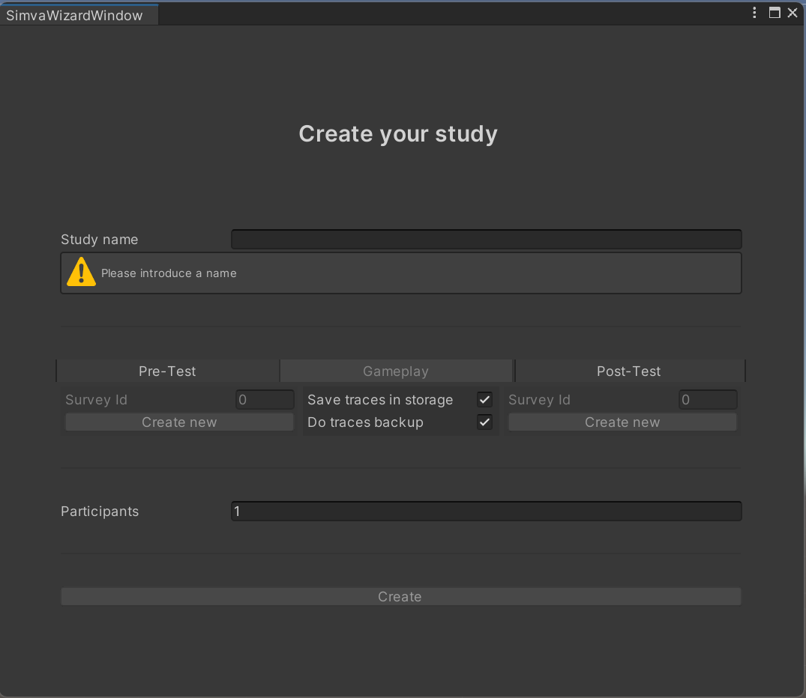
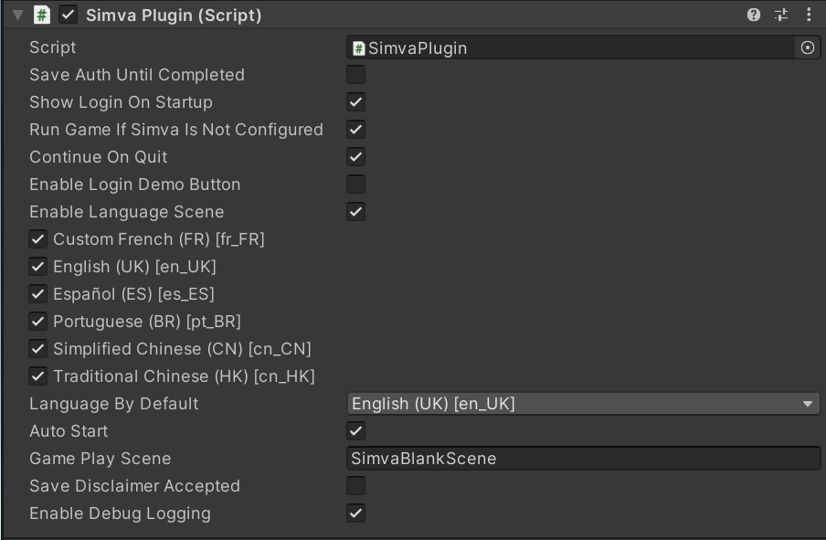
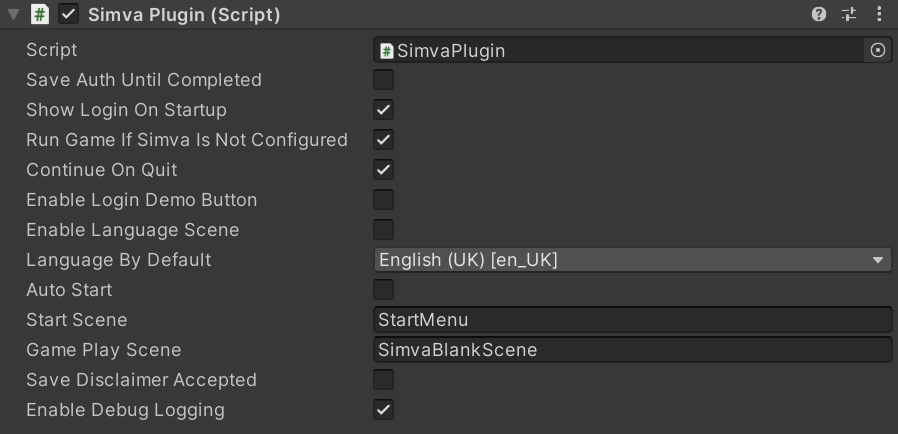
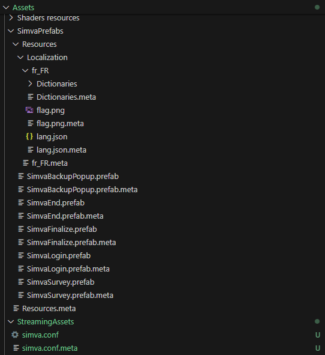
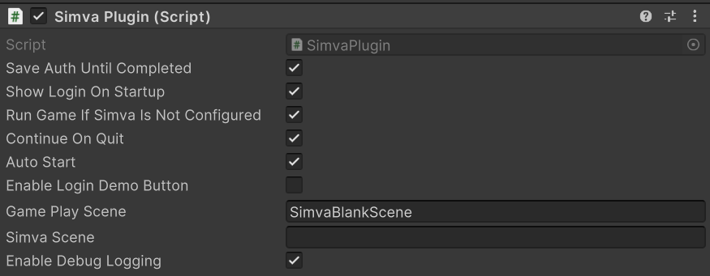

# Simva Unity Plugin

The  is a Unity (https://unity.com/) asset that simplifies use of Simva study process with the gameplay activity in witch it will be integrated and external pre-post activities (survey, manual, etc.) using the same user in all those activities.

Simva Unity Plugin has been developed by the [e-UCM group](https://www.e-ucm.es) and is part of the e-UCM ecosystem of tools for Learning Analytics (Simva, T-mon, Pumva, μfasa and Xasu).

# Documentation

Please find the full Simva Unity Plugin documentation in the Wiki section of this project.
* Wiki: https://github.com/e-ucm/simva-unity-plugin/wiki

# Quick Start Guide

Simva Unity Plugin requires at least **Unity 2019.4 (LTS)**.

## Installation

Simva Unity Plugin can be downloaded through the Unity Package Manager using the [repository link](https://github.com/e-ucm/simva-unity-plugin.git) of this project.

To add it to your proyect:
* Go to ``Window > Package Manager``
* Press the "+" icon.
* Select ``Add package from git...``.
* Insert ```https://github.com/e-ucm/simva-unity-plugin.git``` 
* Press "Add".

If you want to manually include Simva Unity Plugin into your project (for example, by downloading the repository as a .zip), make sure you install also the NewtonSoft.JSON library and Xasu from ```https://github.com/e-ucm/xasu.git``` using the Unity Package Manager.

## Setting up the configuration file

The Simva Unity Plugin configuration file contains settings for overall Simva system. The configuration can be provided either using the `StreamingAssets` folder (recommended) or via scripting. We recommend using the `StreamingAssets` folder to allow configuration to be changed after the game is exported, allowing simpler adaptation of the game to different scenarios without having to recompile the whole game.

### Minimal "simva.conf"

The configuration file must be placed in:

```path
Assets/StreamingAssets/simva.conf
```

The following configuration file represents the study configuration required to process the study using oauth2 authentication via keycloak.

```json
 {
  "study": "<study-id>",
  "host": "<simva-hostname>",
  "url": "<simva-homePageUrl-for-actor-in-traces>",
  "protocol": "<simva-protocol>",
  "port": "<simva-port>",
  "sso": "<sso-openid-url>",
  "client_id": "<client-id>"
}
```

### Simva Wizard Window

You can conect to Simva via this login Wizard :


If you have a configuration file you can You can access to the study via "Open dashboad in Simva" button in this Wizard or print the groups via the "Download users in PDF" :


In you don't have any study configured you can create a study via the wizard that will create a group with the chosen number of participants, a pre/post (optional) and the gameplay activity to store the data in Simva:


## Adding SimvaPlugin to your game

Once SimvaPlugin is installed, to add SimvaPlugin to your game you just have to create a new GameObject in Unity and include the SimvaPlugin component.

If you want to know more about how SimvaPlugin works, please check the Wiki:
* Working with SimvaPlugin: 

### Initializing SimvaPlugin

When SimvaPlugin is added to your scene it will not initialize and connect by default.

To initialize it automatically, please check the "Auto Start" property in the object inspector.
You can also check "Enable Debug Log" to display debug logs in Unity console.

You need to configure some others parameters : 
* Save Auth Until Completed : toggle to save auth until completed
* Show Login On Startup : show login directly on startup
* Run Game If Simva is Not Configured : if not simva.conf is present, enable run game anyway else close game
* Continue On Quit : 
* Enable Login Demo Button : enable Demo button in Login scene
* Enable Language Scene : if enable you can select witch language you want to add to your game language screen that will adapt automatically depending of the number of languages presents to be able to display all languages in same screen.



* Language By Default : if a translation is not found in a different language use this language by default instead.
* Auto Start : Enable Auto Start of the script to redirect to Language or Login screen else redirect to Start Scene.
* Start Scene : name of the Start Scene (needed to redirect to the correct scene. If empty throw error directly).



* GamePlay Scene : name of the GamePlay Scene (needed to redirect to the correct scene. If empty throw error directly).
* Save Disclaimer Accepted : save the disclaimer when come back to the login page or not
* Enable Debug Logging : Enable Simva Unity Plugin Debug Logging

You can copy the prefabs from Runtime/Runner/*.prefab to adapt and customize with them your game interface into your project in folder Assets/SimvaPrefabs/Resources/*.prefab.
You can also copy the Localization from Runtime/Runner/Localization/* to add, adapt and customize with them your game languages into your project in folder Assets/SimvaPrefabs/Resources/Localization/*.



You can also initialize SimvaPlugin manually by using the ```ManualStart``` method:
```cs
  public void Start() {
    StartCoroutine(SimvaPlugin.Instance.ManualStart("en_UK"));
  }
```

You can copy the prefabs from Runtime/Runner/*.prefab to adapt and customize with them your game interface into your project in folder Assets/SimvaPrefabs/Resources/*.prefab.



If you want to learn more about how to initialize SimvaPlugin please visit our Wiki.
* Initializing SimvaPlugin: 

## Sending your first xAPI statement using Xasu (dependency of SimvaPlugin)

If you want to learn more about how to send statements using Xasu please visit our Wiki.
* Sending Statements using Xasu: https://github.com/e-ucm/xasu/wiki/Sending-xAPI-Traces

## Finalizing SimvaPlugin

Before the game is closed, SimvaPlugin has to be finalized manually so the processors of Xasu (online, offline or backup) can perform their final tasks and display the Post Survey if any to the user.

```cs
    bool wants = await Simva.SimvaPlugin.Instance.WantsToQuit();
    Debug.Log("Tracker finalized, game is now ready to close...");
    if (wants)
    {
        if (Application.isEditor)
        {
#if UNITY_EDITOR
            UnityEditor.EditorApplication.isPlaying = false;
#endif
        } else {
            Application.Quit();
        }
    }
```

# Important links

Referenced repositories:

* XASU (xAPI Tracker) : https://github.com/e-ucm/xasu
* Simva Infrastructure : https://github.com/e-ucm/simva-infra
* Simva Backend : https://github.com/e-ucm/simva
* Simva Frontend : https://github.com/e-ucm/simva-front